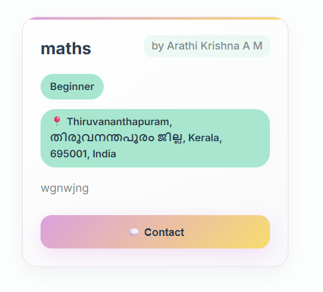
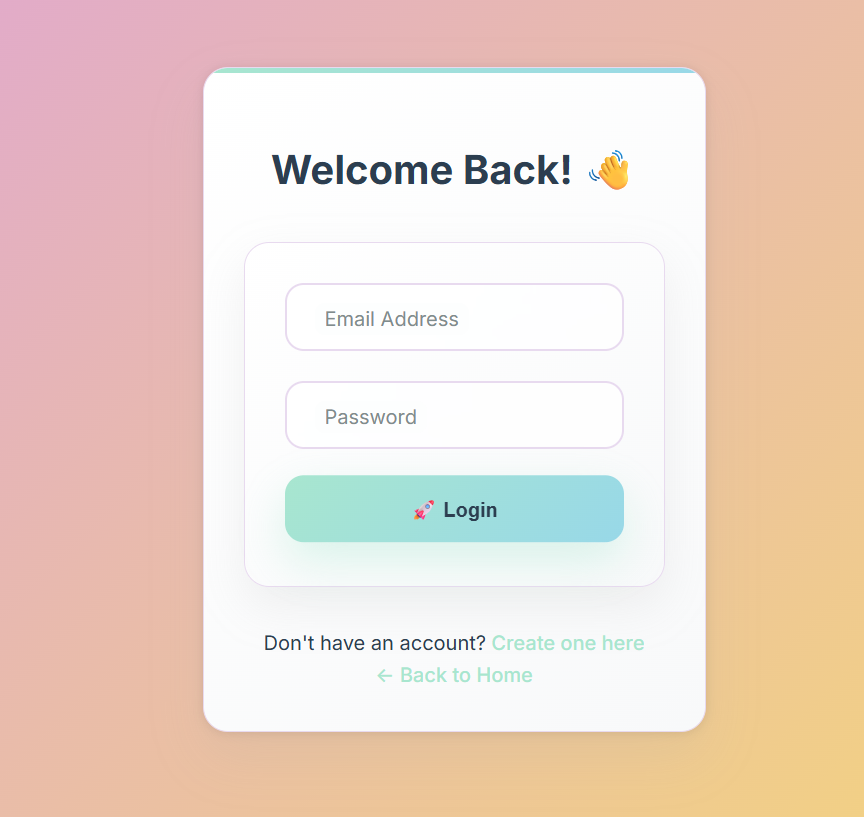
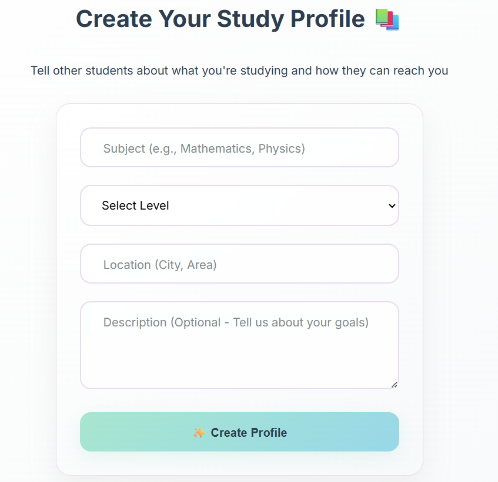

# 📚 Study Buddy Finder
[](https://nodejs.org/)
[](https://postgresql.org/)
[](https://reactjs.org/)

> A web application that connects students with study partners in their local area. Find study buddies, create study groups, and enhance the learning experience through collaborative studying.

## Video Demo
[](https://youtu.be/28U8vVEQUP8)

*Click the image above to watch a complete walkthrough of the Study Buddy Finder application*

**Watch the full demo**: https://youtu.be/28U8vVEQUP8

## Screenshots

### 👤 User Profile Card


### 🔐 Login Interface


### 🏠 Home Page


### 📝 Profile Creation


### 🔍 Browse & Discovery


## Features

### Authentication System
- **Secure User Registration**: Create accounts with email verification
- **JWT-based Login**: Token-based authentication with 7-day expiry
- **Password Security**: Bcrypt encryption with salt rounds
- **Session Management**: Automatic token refresh and logout

### Profile Management
- **Study Profiles**: Create detailed academic profiles
- **Subject Specification**: Add your areas of study and expertise
- **Skill Levels**: Indicate your proficiency (Beginner to Expert)
- **Location Sharing**: Connect with nearby students
- **Personal Descriptions**: Share your study goals and preferences

### Advanced Search & Discovery
- **Real-time Filtering**: Search by subject and location
- **Smart Matching**: Find compatible study partners
- **Interactive Cards**: Beautiful, responsive profile displays
- **Contact Integration**: Easy communication with study buddies

## Prerequisites

Before you begin, ensure you have the following installed:

- **Node.js** (v14.0.0 or higher)
- **npm** (v6.0.0 or higher) or **yarn**
- **PostgreSQL** (v12.0 or higher)
- **Git** for version control

## Installation

### 1. Clone the Repository
```bash
git clone https://github.com/yourusername/study-buddy-finder.git
cd study-buddy-finder
```

### 2. Install Dependencies

#### Backend Dependencies
```bash
cd backend
npm install
```

#### Frontend Dependencies
```bash
cd frontend
npm install
```

### 4. Environment Configuration

#### Backend Environment (.env)
```bash
# Database Configuration
DB_HOST=localhost
DB_PORT=5432
DB_NAME=study_buddy_finder
DB_USER=your_username
DB_PASSWORD=your_password

# JWT Configuration
JWT_SECRET=your_super_secret_jwt_key
JWT_EXPIRES_IN=7d

# Server Configuration
PORT=5000
NODE_ENV=development

# CORS Configuration
FRONTEND_URL=http://localhost:3000
```

#### Frontend Environment (.env)
```bash
REACT_APP_API_URL=http://localhost:5000/api
REACT_APP_APP_NAME=Study Buddy Finder
```

### 5. Start the Application

#### Start Backend Server
```bash
cd backend
node index.js
```

#### Start Frontend Development Server
```bash
cd frontend
npm start
```

The application will be available at:
- **Frontend**: http://localhost:3000
- **Backend API**: http://localhost:5000

## Database Schema

### Users Table
| Column | Type | Constraints |
|--------|------|-------------|
| id | SERIAL | PRIMARY KEY |
| name | VARCHAR(255) | NOT NULL |
| email | VARCHAR(255) | UNIQUE, NOT NULL |
| password | VARCHAR(255) | NOT NULL |
| created_at | TIMESTAMP | DEFAULT CURRENT_TIMESTAMP |

### Profiles Table
| Column | Type | Constraints |
|--------|------|-------------|
| id | SERIAL | PRIMARY KEY |
| user_id | INTEGER | FOREIGN KEY → users(id) |
| subject | VARCHAR(100) | NOT NULL |
| level | VARCHAR(50) | |
| location | VARCHAR(100) | |
| description | TEXT | |
| created_at | TIMESTAMP | DEFAULT CURRENT_TIMESTAMP |

## API Endpoints

### Authentication Routes
- `POST /api/auth/register` - User registration
- `POST /api/auth/login` - User login
- `GET /api/auth/verify` - Verify JWT token

### Profile Routes
- `GET /api/profiles` - Get all profiles (with filtering)
- `POST /api/profiles` - Create new profile
- `GET /api/profiles/:id` - Get specific profile
- `PUT /api/profiles/:id` - Update profile
- `DELETE /api/profiles/:id` - Delete profile

### User Routes
- `GET /api/users/profile` - Get current user profile
- `PUT /api/users/profile` - Update user information

## Technology Stack

### Frontend
- **React.js** - Component-based UI framework
- **React Router** - Client-side routing
- **Axios** - HTTP client for API requests
- **CSS3** - Modern styling with gradients and animations

### Backend
- **Node.js** - JavaScript runtime environment
- **Express.js** - Web application framework
- **PostgreSQL** - Relational database
- **JWT** - JSON Web Tokens for authentication
- **Bcrypt** - Password hashing library

### Development Tools
- **Nodemon** - Development server auto-restart
- **CORS** - Cross-origin resource sharing
- **dotenv** - Environment variable management

## Contributing

1. Fork the repository
2. Create a feature branch (`git checkout -b feature/amazing-feature`)
3. Commit your changes (`git commit -m 'Add some amazing feature'`)
4. Push to the branch (`git push origin feature/amazing-feature`)
5. Open a Pull Request

## Future Enhancements

- 📱 Mobile app development
- 💬 Real-time messaging system
- 📅 Study session scheduling
- ⭐ Rating and review system
- 🔔 Push notifications
- 🎯 AI-powered study buddy matching

## Support

If you encounter any issues or have questions, please:

1. Check the existing issues on GitHub
2. Create a new issue with detailed description
